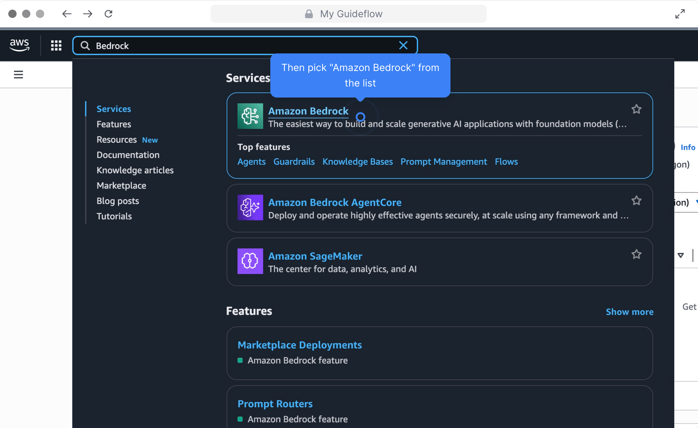
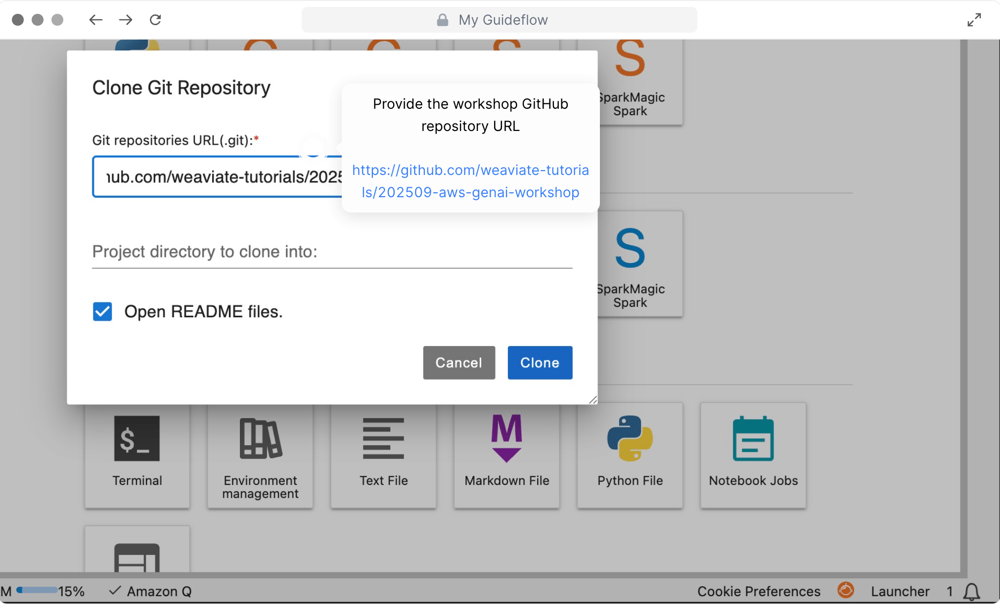

# AWS GenAI + Weaviate: *Hands-on Workshop*

This repository is for a hands-on workshop for building intelligent search systems, RAG workflows, and AI agents, with [Weaviate vector database](https://docs.weaviate.io/weaviate) and [AWS Bedrock](https://aws.amazon.com/bedrock/) in less than a day.

## Prerequisites

**None**: At the workshop, a temporary AWS account will be provided for you to use.

Recommended: Some familiarity with AWS services and Python programming.

> [!CAUTION]
> Optionally, you can run the workshop on your own AWS account. **Doing so will incur costs on your own account.** We cannot be responsible for any costs incurred on your personal AWS account. Please proceed with caution and at your own risk.

## Setup instructions

### Login & Bedrock access

1. Download this [CloudFormation template file (0-setup-weaviate.yaml)](./0-setup-weaviate.yaml).
2. Click on the provided AWS workshop link (to be provided on the day of the workshop)
3. **Follow [this visual guide](https://app.guideflow.com/player/zklz623bop)**. It shows how to:
    - Access the AWS workshop account.
      - You may need to authenticate with a one-time password (OTP) sent to your email.
    - Open the AWS Management Console
    - Obtain access to the Bedrock AI models
    - Spin up a Weaviate database on AWS ECS
    - Set up SageMaker Studio where you will run the workshop notebooks

Preview:

| Open AWS Console | Go to Bedrock | Request model access |
|----------|----------|----------|
|  |  |  |

### Multimodal RAG workshop setup

1. Follow this [visual guide for setting up the Multimodal RAG workshop](https://app.guideflow.com/player/3r3d3nmsnp). This shows you how to:
    - Set up a SageMaker Studio JupyterLab environment
    - Clone this repository into your SageMaker Studio environment
2. Go to the `multimodal-rag` directory and open the `0-setup.ipynb` notebook.

Preview:

| Go to SageMaker Studio | Open a JupyterLab instance | Clone the repo |
|----------|----------|----------|
|  |  |  |

**Go to the [visual guide](https://app.guideflow.com/player/3r3d3nmsnp) for the full instructions.**

### Agent workshop setup

1. Go to SageMaker Studio and open Code Editor.
2. Clone this repository into your SageMaker Studio environment:
    - Go to the Git tab on the left sidebar
    - Click on the "Clone a Repository" button
    - Enter the URL of this repository: `https://github.com/weaviate-tutorials/202509-aws-genai-workshop.git`
3. Open the `agent` directory and start with `0-setup.ipynb` notebook.

## Repository notes

- For students, most of the required packages are pre-installed in the SageMaker Studio environment.
    - The notebooks include any installation instructions for any additional required packages.
- This project was developed with `uv`. The primary list of required packages are in `pyproject.toml`; although a `requirements.txt` file is also provided for convenience.

## Instructor / developer notes

- There are two versions of notebooks in the `multimodal-rag` workshop:
    - `*.ipynb`: The student notebooks with student TODOs
    - `*-complete.ipynb`: The completed notebooks with solutions
- Run `generate_student_notebooks.py` from the `multimodal-rag` directory to regenerate the student notebooks from the completed notebooks.
    - See the comments in the script for more details.
