## Chapter 2: Technical Performance

## RAG: Retrieval Augment Generation (RAG)

An  increasingly  common  capability  being  tested  in  LLMs is retrieval-augmented generation (RAG). This approach integrates LLMs  with retrieval mechanisms  to enhance their  response  generation. The  model fi rst  retrieves  relevant information  from fi les  or  documents  and  then  generates  a response tailored to the user's query based on the retrieved content.  RAG  has  diverse  use  cases,  including  answering precise questions from large databases and addressing customer queries using information from company documents.

models. 2024 also saw the release of numerous benchmarks for  evaluating  RAG  systems,  including  Ragnarok  (a  RAG arena battleground) and CRAG (Comprehensive RAG benchmark). Additionally, specialized RAG benchmarks, such as FinanceBench for fi nancial question answering, have been developed to address speci fi c use cases.

## Berkeley Function Calling Leaderboard

In recent years, RAG has received increasing attention from researchers  and  companies.  For  example,  in  September 2024, Anthropic introduced Contextual Retrieval, a method that signi fi cantly enhances the retrieval capabilities of RAG

The  Berkeley  Function  Calling  Leaderboard  evaluates  the ability  of  LLMs  to  accurately  call  functions  or  tools.  The evaluation suite includes over 2,000  question-functionanswer pairs across multiple programming languages (such as  Python,  Java,  JavaScript,  and  REST  API)  and  spans  a variety of testing domains (Figure 2.2.17).

## Data composition on the Berkeley Function Calling Leaderboard

Source: Yan et al., 2024

## Berkeley Function-Calling Leaderboard Evaluation Data Composition

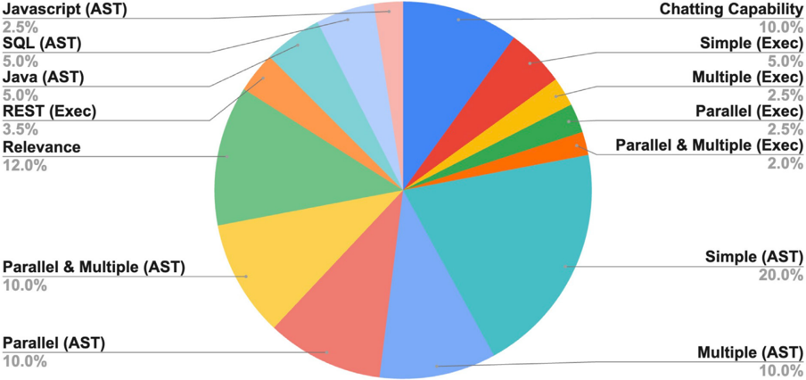

Figure 2.2.17 9

| Javascript (AST)          | Chatting Capability             |
|---------------------------|---------------------------------|
| 2.5%                      | 10.0%                           |
| SQL (AST) 5.0%            | Simple (Exec)                   |
| Java (AST)                | 5.0% Multiple (Exec)            |
| 5.0% REST (Exec)          | 2.5% Parallel (Exec)            |
| Relevance 12.0%           | 2.5% Parallel & Multiple (Exec) |
| Parallel & Multiple (AST) | Simple (AST) 20.0%              |
|                           | 2.0%                            |
| 10.0%                     |                                 |
| Parallel (AST)            | Multiple (AST)                  |
| 10.0%                     | 10.0%                           |

9 In this context: AST (abstract syntax tree) refers to tasks that involve analyzing or manipulating code at the structural level, using its parsed representation as a tree of syntactic elements. Evaluations labeled with 'AST' likely test an AI model's ability to understand, generate, or manipulate code in a structured manner. Exec (execution-based) indicates tasks that require actual execution of function calls to verify correctness. Evaluations labeled with 'Exec' likely assess whether the AI model can correctly call and execute functions, ensuring the expected outputs are produced.

## Chapter 2: Technical Performance

2.2 Language

The top model on the Berkeley Function Calling Leaderboard is  watt-tool-70b,  a fi ne-tuned  variant  of  Llama-3.3-70BInstruct designed speci fi cally for function calling. It achieved an overall accuracy of 74.31 (Figure 2.2.18). The next-highestscoring  model  was  a  November variant  of  GPT-4o,  with  a score of 72.08. Performance on this benchmark has improved signi fi cantly over the course of 2024, with top models at the end of the year achieving accuracies up to 50 points higher than those recorded early in the year.

## Berkeley Function-Calling: overall accuracy

Model

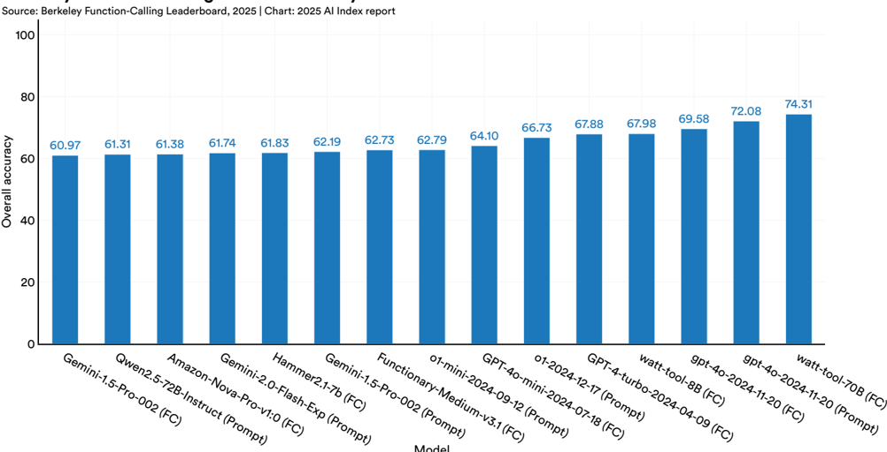

Figure 2.2.18

## Chapter 2: Technical Performance

2.2 Language

## MTEB: Massive Text Embedding Benchmark

The  Massive Text  Embedding  Benchmark  (MTEB),  created by a team at Hugging Face and Cohere, was introduced in late 2022 to comprehensively evaluate how models perform on various embedding tasks. Embedding involves converting data,  such  as  words,  texts,  or  documents,  into  numerical vectors that capture rough semantic meanings and distance between vectors. Embedding is an essential component of RAG. During a RAG task, when users input a query, the model

## Tasks in the MTEB benchmark

Source: Muennigho ff et al., 2023

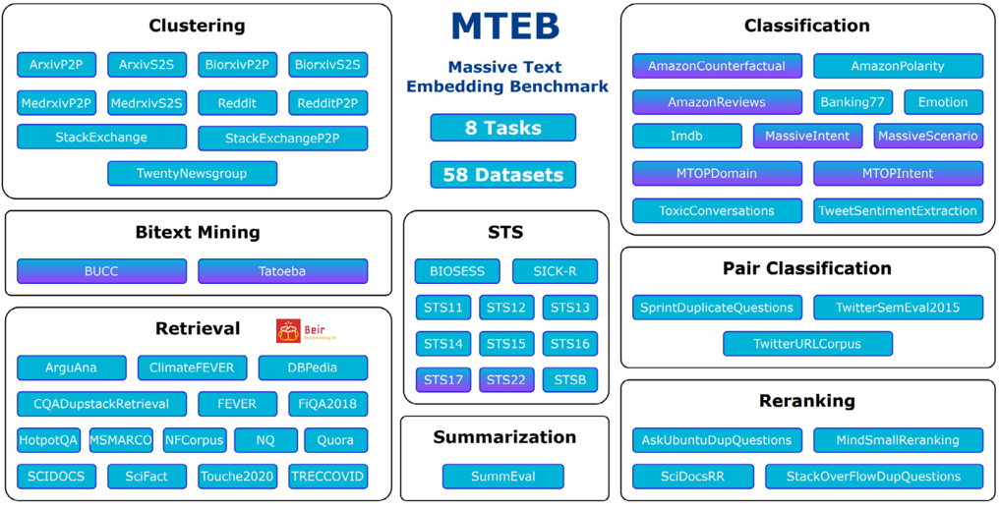

Figure 2.2.19

transforms it into an embedding vector. This transformation enables the  model to then  search for  relevant  information. MTEB  includes  58  datasets  spanning  112  languages  and eight embedding tasks (Figure 2.2.19). 10  For example, in the bitext mining task, there are two sets of sentences from two di ff erent languages, and for every sentence in the fi rst  set, the model is tasked to fi nd the best match in the second set.

## 2.8 AI Agents Chapter 2: Technical Performance

AI agents, autonomous or semiautonomous systems designed to operate within  speci fi c  environments to accomplish goals, represent an  exciting  frontier in  AI  research. These agents have a diverse range of potential  applications,  from  assisting in  academic research and scheduling meetings to facilitating online shopping  and  vacation  booking.  As suggested by many recent corporate releases,  agentic  AI  has  become  a topic of increasing interest in the technical world of AI.

## 2.8 AI Agents

For decades, the topic of AI agents has been widely discussed in the AI community, yet few benchmarks have achieved widespread adoption, including those featured in last year's Index, such as AgentBench and MLAgentBench. This is partly due to the  inherent  complexity  of  benchmarking  agentic tasks, which  are typically  more diverse,  dynamic,  and  variable  than  tasks  like  image  classi fi cation  or  answering language questions. As AI continues to evolve, it will become important to develop e ff ective methods to evaluate AI agents.

## VisualAgentBench

VisualAgentBench  (VAB),  launched  in  2024,  represents  a signi fi cant step forward in the evaluation of agentic AI. This benchmark re fl ects the growing multimodality of AI models and their increasing pro fi ciency in navigating both virtual and embodied environments. VAB addresses the need to assess agent  performance  in  diverse  settings  that  extend  beyond environments  reliant  solely  on  linguistic  commands.  VAB

tests agents across three broad categories of tasks: embodied agents (operating  in  household  and  gaming  environments), GUI agents (interacting with mobile and web applications), and visual  design  agents  (such  as  CSS  debugging)  (Figure 2.8.1). This comprehensive approach creates a robust evaluation  suite  of  agents'  capabilities  across  varied  and dynamic contexts.

## Tasks on VisualAgentBench

Source: Liu et al., 2024

Figure 2.8.1

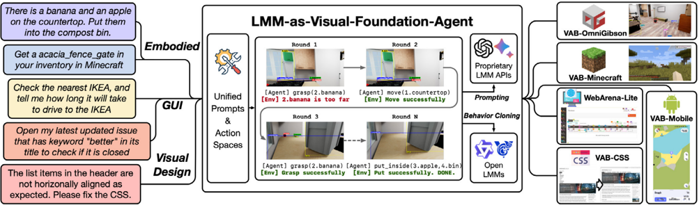

## 2.8 AI Agents Chapter 2: Technical Performance

VAB presents a signi fi cant challenge for AI systems. The topperforming model, GPT-4o, achieves an overall success rate of just 36.2%, while most proprietary language models average around  20%  (Figure  2.8.2).  According  to  the  benchmark's authors, these results reveal that current AI models are far from ready for direct deployment in agentic settings.

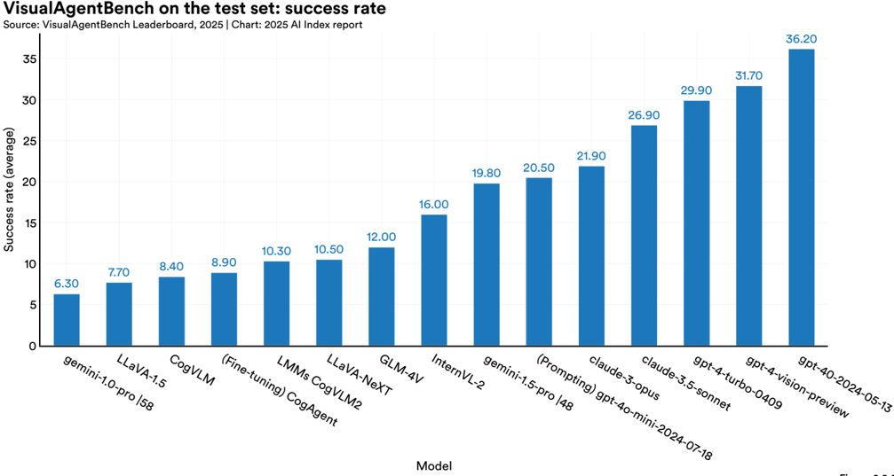

Figure 2.8.2

## RE-Bench

The emergence of increasingly capable agentic AI systems has fueled predictions that AI might soon take on the work of computer scientists or  researchers.  However,  until  recently, there were few benchmarks designed to rigorously test the R&amp;D capabilities of top-performing AI systems.  In  2024,  researchers  addressed this gap with the launch of RE-Bench, a benchmark featuring  seven  challenging,  open-ended  ML research environments. These tasks, informed by  data  from  71  eight-hour  attempts  by  over 60 human experts, include optimizing a kernel, conducting a scaling law experiment, and fi netuning GPT-2 for question answering, among others (Figure 2.8.3).

## RE-Bench Process and Flow

Source: Wijk et al., 2024

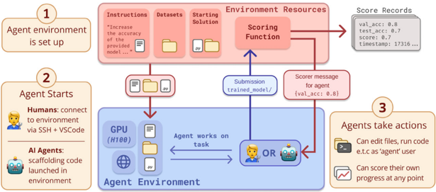

Figure 2.8.3

## 2.8 AI Agents Chapter 2: Technical Performance

Researchers uncovered two key fi ndings when comparing the performance of humans and frontier AI models. In short time horizon settings, such as with a two-hour budget, the best AI systems achieve scores four times higher than human experts (Figure 2.8.4). However, as the time budget increases, human performance begins to surpass that of AI. With an eight-hour budget, human performance slightly exceeds AI, and with a

32-hour budget, humans outperform AI by a factor of two. The  researchers  also  note  that  for  certain  tasks,  AI  agents already  demonstrate  expertise  comparable  to  humans  but can  deliver  results  signi fi cantly  faster  and  at  a  lower  cost. For example, AI agents can write custom Triton kernels more quickly than any human expert.

RE-Bench: average normalized score@k

Source: Wijk et al., 2024 | Chart: 2025 AI Index report

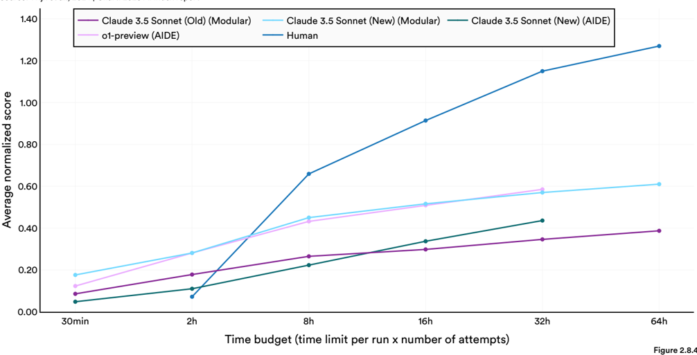

## Chapter 2: Technical Performance

## Self-Driving Cars

Self-driving vehicles have long been a goal for AI researchers and technologists. However, their widespread adoption has been  slower  than  anticipated.  Despite  many  predictions that  fully  autonomous  driving  is  imminent,  widespread  use of  self-driving  vehicles  has yet  to  become  a  reality.  Still,  in recent  years,  signi fi cant  progress  has  been  made.  In  cities like  San  Francisco  and  Phoenix, fl eets  of  self-driving  taxis are  now  operating  commercially.  This  section  examines recent advancements in autonomous driving, focusing on deployment, technological breakthroughs and new benchmarks, safety performance, and policy challenges.

## Deployment

Self-driving cars are increasingly being deployed worldwide. Cruise, a subsidiary of General Motors, launched its autonomous vehicles  in  San  Francisco  in  late  2022  before having its license suspended in 2023 after a litany of safety incidents. Waymo, a subsidiary of Alphabet, began deploying its  robotaxis in Phoenix in early 2022 and expanded to San Francisco in 2024. The company has since emerged as one of the more successful players in the self-driving industry: As of January 2025, Waymo operates in four major U.S. citiesPhoenix,  San  Francisco,  Los  Angeles,  and  Austin  (Figure 2.9.11). Data sourced from October 2024 suggests that across the four cities the company provides 150,000 paid rides per week, covering over a million miles. Looking ahead, Waymo plans to test its vehicles in 10 additional cities, including Las Vegas,  San  Diego,  and  Miami.  The  company  chose  testing locations, such as upstate New York and Truckee, California, that experience snowy weather so it can assess the vehicles in  diverse  driving  conditions.  There  has  also  been  notable progress  in  self-driving  trucks,  with  companies  like  Kodiak completing its fi rst driverless deliveries and Aurora reporting steady  advancements,  including  over  1  million miles of autonomous freight  hauling  on  U.S.  highways  since  2021albeit  with  human  safety  drivers  present.  Still,  challenges remain  in  bringing  this  technology  to  market,  with  Aurora recently announcing it would delay the commercial launch of its fl eet from the end of 2024 until April 2025.

## Waymo rider-only miles driven without a human driver

Source: Waymo, 2024 | Table: 2025 AI Index report

| LRFDWLRQ                | 5LGHUGLYPH<c=16,font=/AAAAEW+CircularStd-Bold>RQO\GLYPH<c=3,font=/AAAAEW+CircularStd-Bold>PLOHVGLYPH<c=3,font=/AAAAEW+CircularStd-Bold>WKURXJK 6HSWHPEHUGLYPH<c=3,font=/AAAAEW+CircularStd-Bold>GLYPH<c=21,font=/AAAAEW+CircularStd-Bold>GLYPH<c=19,font=/AAAAEW+CircularStd-Bold>GLYPH<c=21,font=/AAAAEW+CircularStd-Bold>GLYPH<c=23,font=/AAAAEW+CircularStd-Bold>   |
|-------------------------|------------------------------------------------------------------------------------------------------------------------------------------------------------------------------------------------------------------------------------------------------------------------------------------------------------------------------------------------------------------------|
| L o s A n g e l e s     | 1 . 9 4 7 M                                                                                                                                                                                                                                                                                                                                                            |
| S a n F r a n c i s c o | 1 0 . 20 9 M                                                                                                                                                                                                                                                                                                                                                           |
| P h o e n i x           | 20 . 823 M                                                                                                                                                                                                                                                                                                                                                             |
| A u s t i n             | 1 2 4 K                                                                                                                                                                                                                                                                                                                                                                |

Figure 2.9.11

China's  self-driving  revolution  is  also  accelerating,  led  by companies like Baidu's Apollo Go, which reported 988,000 rides across China in Q3 2024, re fl ecting a 20% year-over-year increase. In October 2024, the company was operating 400 robotaxis and announced plans to expand its fl eet to 1,000 by the end of 2025. Pony.AI, another Chinese autonomous vehicle manufacturer, has pledged to scale its robotaxi fl eet from 200 to at least 1,000 vehicles-with expectations that the fl eet will reach 2,000 to 3,000 by the end of 2026. China is leading the way in autonomous vehicle testing, with reports indicating  that  it  is  testing  more  driverless  cars  than  any other country and currently rolling them out across 16 cities. Robotaxis  in  China  are  notably  a ff ordable-even  cheaper, in  some  cases,  than  rides  provided  by  human  drivers.  To support  this growth, China  has prioritized establishing national regulations to govern the deployment of driverless cars.  Beyond the self-driving  revolution taking  place  in the U.S. and China, European startups like Wayve are beginning to gain traction in the industry.

## Chapter 2: Technical Performance

2.9 Robotics and Automous Motion

## Technical Innovations and New Benchmarks

Over  the  past  year,  self-driving  technology  has  advanced signi fi cantly,  both  in  vehicle  capabilities  and  benchmarking methods.  In  October  2024,  Tesla  unveiled  the  Cybercab,  a two-passenger autonomous vehicle without a steering wheel or  pedals,  which  is  set  for  production  in  2026  at  a  price  of under  $30,000. Tesla  also  unveiled  the  Robovan,  an  electric autonomous van designed to transport up to 20 passengers. Meanwhile, Baidu's Apollo Go launched its latest-generation robotaxi, the RT6, across multiple cities in China (Figure 2.9.12). With a price tag of just $30,000 and a battery-swapping system, the  RT6  represents  a  major  step  toward  making  self-driving technology more cost-e ff ective and scalable. As costs continue to decline, the adoption of autonomous vehicles is expected to accelerate. Notable business partnerships have also advanced self-driving  technology,  including  Uber's  collaboration  with WeRide-the world's fi rst publicly listed robotaxi companyto develop an autonomous ride-sharing platform in Abu Dhabi.

In 2024, several new benchmarks were introduced to evaluate self-driving capabilities. One  notable example  is nuPlan, developed by Motional. It is a large-scale, autonomous driving dataset designed to test machine-learning-based motion planners.  The  benchmark  includes  1,282  hours  of  diverse driving scenarios from multiple cities, along with a simulation and  evaluation  framework  that  enables  planners'  actions  to be tested in closed-loop settings. Another recent benchmark is  OpenAD,  the fi rst  real-world,  open-world  autonomous driving benchmark for 3D object detection. OpenAD focuses on domain generalization-the ability of autonomous driving systems to  adapt  across  diverse  sensor  con fi gurations-and open-vocabulary recognition, which allows systems to identify previously unseen semantic categories.

## An overview of Bench2Drive

Source: Jia et al., 2024

Figure 2.9.13

Baidu's RT-6

Source: Verge, 2024

Figure 2.9.12

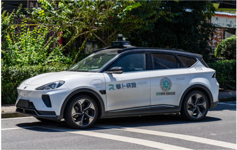

Most existing benchmarks  for end-to-end autonomous driving rely on open-loop evaluation, which can be restrictive. Open-loop settings fail to test how autonomous agents  react  to  real-world  conditions  and  often  lead  to models that memorize driving patterns rather than learning to  drive  authentically.  While  closed-loop  benchmarks  like Town05Long and Longest6 exist, they primarily assess basic driving skills rather than performance in complex, interactive scenarios.  Bench2Drive  is  another  new  benchmark  that improves on these limitations by providing a comprehensive, realistic, closed-loop testing simulation environment for endto-end  autonomous  vehicles  (Figure  2.9.13).  It  includes  a training set with over 2 million fully annotated frames sourced from more than 10,000 clips, as well as an evaluation suite with 220 short routes designed to test autonomous driving capabilities in diverse conditions. Figure  2.9.14 displays the  driving  scores  of  various  autonomous  driving  methods evaluated on the Bench2Drive benchmark. 13

1. Strong Expert Unified &amp; Diverse LargeScale Training Set

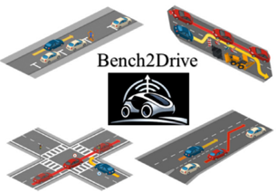

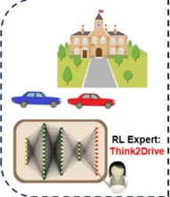

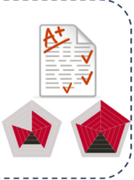

2. Quasi-Realistic Scenario Closed-Loop (E2E) Evaluation

Multi-dimensional Ability Assessment

13 This metric accounts for both route completion and infractions, averaging route completion percentages while applying penalties based on infraction severity. For more detail on the driving score methodology, see Section 3 of the Bench2Drive paper .