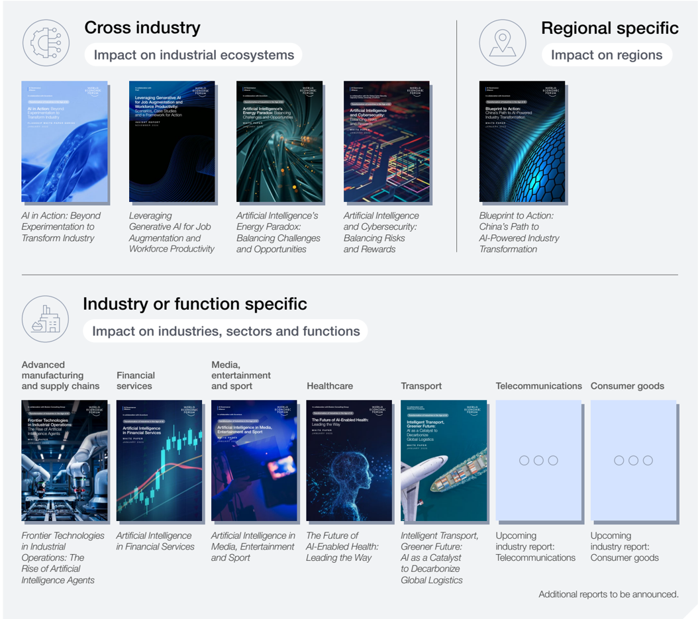
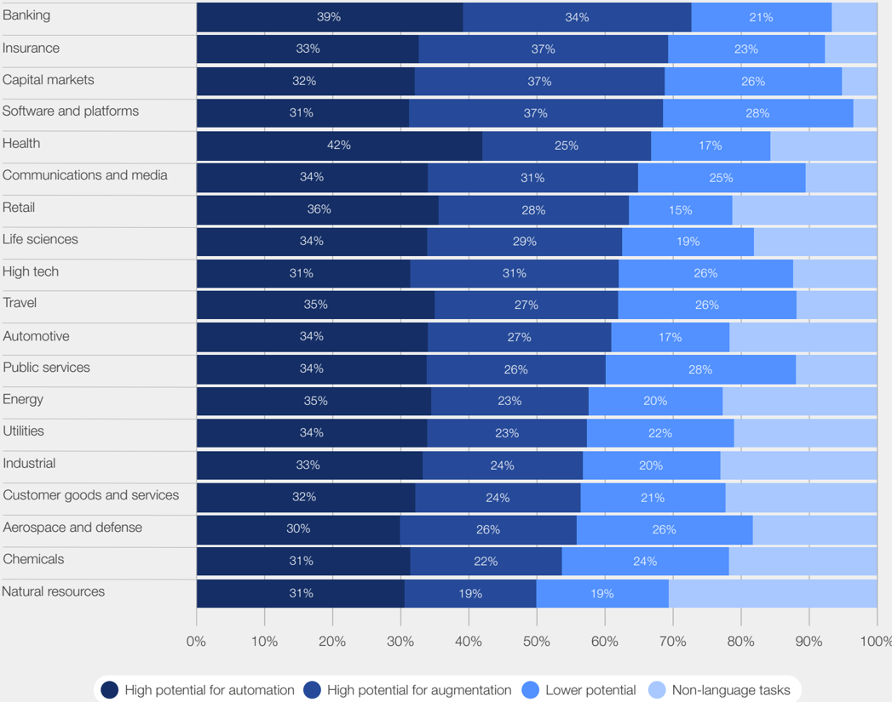
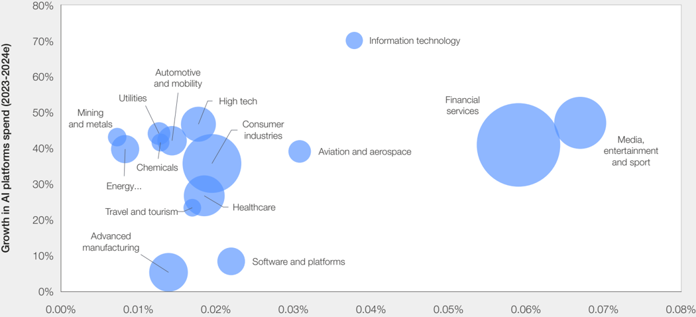
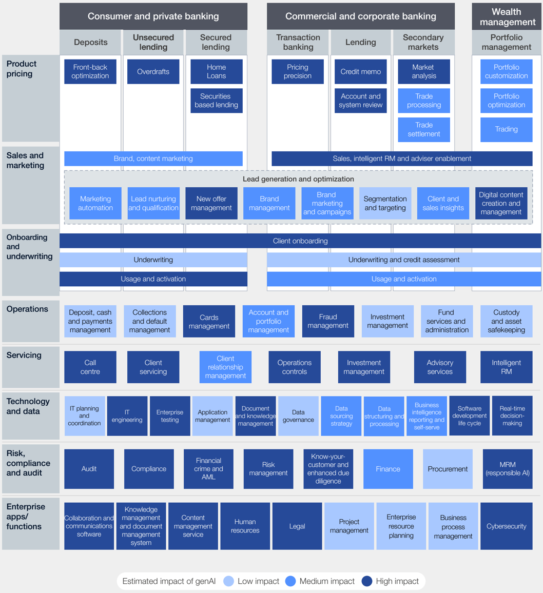
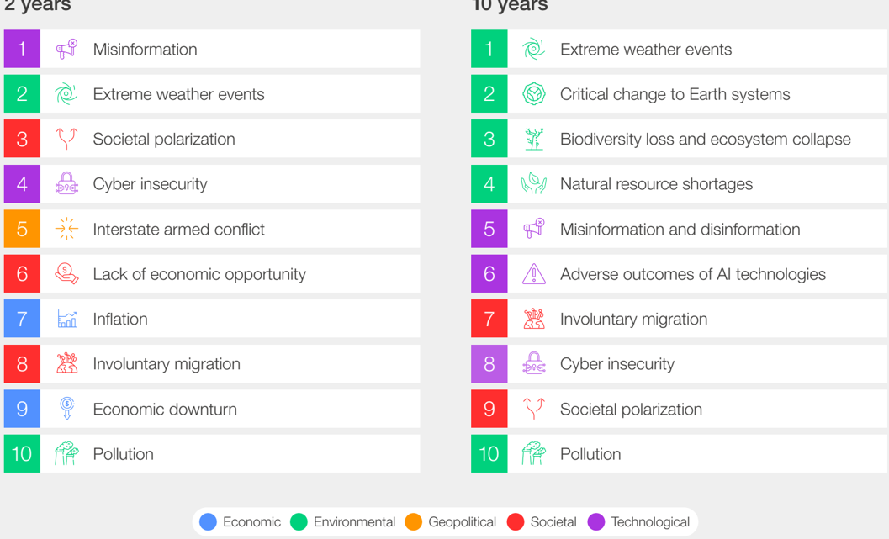
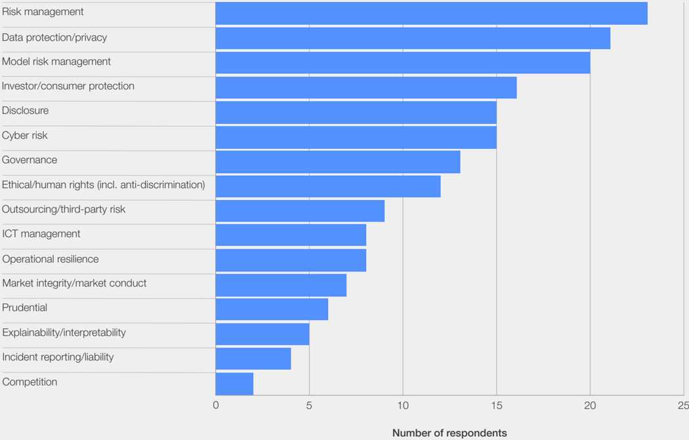

AI Governance Alliance

In collaboration with Accenture

Transformation of Industries in the Age of AI

## Artificial Intelligence in Financial Services

WHI T E   P A P E R J A N U A R Y   2 0 2 5

## Contents

| Reading guide     | Reading guide                             |   3 |
|-------------------|-------------------------------------------|-----|
| Foreword          | Foreword                                  |   4 |
| Executive summary | Executive summary                         |   5 |
| Introduction      | Introduction                              |   6 |
| 1                 | AI landscape in financial services        |   7 |
| 2                 | Seeing early value from AI implementation |  11 |
| 3                 | Moving towards an AI-powered future       |  12 |
| 4                 | AI in the workforce                       |  14 |
| 5                 | AI risks and challenges                   |  15 |
| 6                 | Prioritizing responsible AI               |  17 |
| 7                 | AI regulation challenges                  |  18 |
| Conclusion        | Conclusion                                |  20 |
| Contributors      | Contributors                              |  21 |
| Endnotes          | Endnotes                                  |  25 |

## Disclaimer

This document is published by the World Economic Forum as a contribution to a project, insight area or interaction. The findings, interpretations and conclusions expressed herein are a result of a collaborative process facilitated and endorsed by the World Economic Forum but whose results do not necessarily represent the views of the World Economic Forum, nor the entirety of its Members, Partners or other stakeholders.

© 2025 World Economic Forum. All rights reserved. No part of this publication may be reproduced or transmitted in any form or by any means, including photocopying and recording, or by any information storage and retrieval system.

## Reading guide

The World Economic Forum's AI Transformation of Industries initiative seeks to catalyse responsible industry transformation by exploring the strategic implications, opportunities and challenges of promoting artificial intelligence (AI)-driven innovation across business and operating models.

This white paper series explores the transformative role of AI across industries. It provides insights through both broad analyses and in-depth explorations of industry-specific and regional deep dives. The series includes:

As AI continues to evolve at an unprecedented pace, each paper in this series captures a unique perspective on AI - including a detailed snapshot of the landscape at the time of writing. Recognizing that ongoing shifts and advancements are already in motion, the aim is to continuously deepen and update the understanding of AI's implications and applications through collaboration with the community of World Economic Forum partners and stakeholders engaged in AI strategy and implementation across organizations.

Together, these papers offer a comprehensive view of AI's current development and adoption, as well as a view of its future potential impact. Each paper can be read stand-alone or alongside the others, with common themes emerging across industries.

## Foreword

Andre Belelieu Head, Financial Services Industries, World Economic Forum

David Parker Global Financial Services Industry Practices Chair, Accenture

Artificial intelligence (AI) - and particularly generative AI (genAI) - soared to the top of the agenda for businesses, policy-makers and other stakeholders in 2024. There was no shortage of discussion across various forums about the technology's profound impact and the potential direction of future policy frameworks; nevertheless, the World Economic Forum, responding to the increasing interest in the evolution of AI, launched its own dialogue series within the financial services sector. The aim was to explore a fundamental question: how might this technology not only influence the strategic direction of individual financial institutions, but also transform the entire financial services landscape in the years to come?

Over the course of 2024, the Forum brought together over 100 experts representing more than 50 financial services organizations to begin addressing this critical question. In addition to banks, input was sought from across insurance, asset management, the investor ecosystem and key fintech (financial technology) players to allow for an exchange of perspectives and best practices around a technology that was developing so

Drew Propson Head, Technology and Innovation in Financial Services, World Economic Forum

rapidly that many organizations felt overwhelmed. Beyond virtual meetings, stakeholders from the private sector participated in Forum-led roundtables in London, New York and Bangkok where they debated both the transformative opportunities AI offers and how business and society could most responsibly manage the concurrent risks AI is presenting.

This paper, a collaborative effort between the World Economic Forum and Accenture, represents an initial attempt to synthesize key insights from the dialogue series, alongside supporting desk research. We hope this paper will serve as a valuable resource for a broad range of stakeholders across the financial services ecosystem, and will inspire further examination of AI's potential within the sector. This work is part of the Forum's AI Governance Alliance (AIGA) - a 500-member group focused on fostering the inclusive, ethical and sustainable use of AI for the benefit of all. Looking ahead, we are eager to build on the insights from this paper in the coming year, as we lead a deeper exploration of the future of financial services in the era of AI.

## Executive summary

Artificial intelligence is transforming financial services, offering efficiency and revenue growth opportunities, but also posing significant risks and challenges.

This paper, the first in a series on artificial intelligence (AI) in financial services, draws on insights from roundtable discussions with over 100 financial services executives worldwide, as well as from the latest external research on AI.

As exploration of AI's far-reaching impact continues, the aim of this paper is to provide an overview of the state of AI in financial services, along with key open questions and potential risks to be considered by business leaders, policy-makers and customers.

## Key insights:

Financial services businesses with their data-rich and language-heavy operations are uniquely positioned to capitalize on the developments of AI and have been doing so for years. More recently, with the developments of generative AI (genAI), research indicates that 32-39% of the work performed across capital markets, insurance and banking businesses has high potential to be fully automated and 34-37% holds high augmentation potential. This has driven a significant increase in new AI investment.

In 2023, financial services firms spent $35 billion on AI, with projected investments across banking, insurance, capital markets and payments businesses expected to reach $97 billion by 2027. With this sizeable investment, financial services are one of the most heavily invested industries in AI, with prominent use cases across the enterprise where automation and machine learning are streamlining tasks, reducing operational costs and improving accuracy.

With much of the existing AI adoption in financial services largely focused on driving efficiency, the attention of business leaders is now shifting towards revenue growth opportunities. Backend applications will continue to be important; in addition, approximately 70% of financial services executives believe AI will directly contribute to revenue growth in the coming years.

The rapid maturing of AI, coupled with an expanding list of applicable uses, is pushing the industry towards reinvention at an unprecedented - and often uncomfortable speed and scale. As technological developments accelerate, the integration of various emerging innovations, such as small language models, AI agents and quantum computing will drive both innovation and uncertainty across financial services. This shift will continue to challenge business leaders, policy-makers and regulators.

Looking ahead, financial services stakeholders must increase collaboration to address key risks such as data transparency, privacy, cybersecurity and the spread of misinformation, while also closing policy gaps that could hinder the use and innovation of AI. Overcoming these challenges is essential to ensuring that AI can be leveraged effectively and responsibly across the industry, now and in the future.

The rapid speed at which AI is maturing, combined with the explosion of potential use cases, presents a particular challenge for financial services executives and board members.

## Introduction

Artificial intelligence continues to present unique opportunities and challenges across financial services, disrupting business models, investments and the workforce.

The digitalization of financial services - from the advent of ATMs (automated teller machines) and online banking to the widespread use of mobile apps - transformed the industry from all perspectives: providers, customers, employees, regulators and other stakeholders. Artificial intelligence (AI) is poised to have at least as profound an impact, albeit with important differences.

The digital era started in the mid-1980s and is broadly considered to have run for three to four decades. AI has, in fact, been around a lot longer; however, the introduction and widespread adoption of generative AI (genAI) and its increased accessibility two years ago have had a seismic effect on technology and business. Its potential to automate and augment tasks throughout the operating models of most organizations quickly established it as one of the most transformative technologies the world has ever seen. Banking, insurance, capital markets and payments are among the areas in which its impact is expected to be most pervasive (see Figure 1).

The rapid speed at which AI is maturing, however, combined with the explosion of potential use cases, presents a particular challenge for financial services executives and board members. Most have limited knowledge and experience of technology, yet they are expected to develop a vision of how AI will change their industry, their business and operating models, their offerings and experiences, and their workforces. As some early adopters of genAI are already trumpeting their achievements, financial services leaders are starting to feel intense pressure to strategize their investments to seize the opportunities that are patently on offer. At the same time, executives will need to act immediately to defend their systems, data and customers against a potent new threat, while preparing to comply with a raft of new regulations.

Never before has the industry attempted to reinvent itself, its practices and its offerings so extensively at such a rapid pace. This paper aims to help industry leaders address this challenge by summarizing the areas in which AI is likely to have the greatest impact, the fundamental steps that are needed to achieve this impact, and the risks posed by the technology alongside how they might be mitigated. By examining trends and forecasts in the industry, the paper hopes to encourage engagement from all parties in the future role of AI in financial services. By promoting a better understanding of both the potential and the risks of the technology, it seeks to help build a foundation for the effective and responsible application of AI for the benefit of all.

FI G U R E   1

## AI landscape in financial services

Financial services is leading in AI investment, harnessing the technology to enhance efficiency across functions, reduce risk and manage fraud.

Financial services firms have been using AI in their processes for decades. Shortly after the advent of genAI, it became evident that these firms because so much of what they do is languagebased - had a greater potential than most others to capitalize on large language models (LLMs). In fact, the tasks that take up almost half of all the time spent by financial services employees are well suited to either automation or augmentation (see Figure 1).

The potential impact of LLMs across all major industries

## Work time distribution across US industries

Source: Accenture. (2023.) A new era of generative AI for everyone . https://www.accenture.com/content/dam/accenture/final/accenture-com/document/ Accenture-A-New-Era-of-Generative-AI-for-Everyone.pdf#zoom=40.

It' s no surprise, therefore, that financial services businesses are exploring, investing in and implementing AI at a faster rate than other industries (see Figure 2). As its early pilots deliver promising outcomes and start to be scaled across the enterprise, the commitment of the industry is

## Estimated global AI spend, by industry (2024) FI G U R E   2

## AI platforms spend by industry, 2023-2024e

Growth in spend, spend/revenues and relative total spend

## AI platforms spend/total revenues (2024e)

Bubble size: total AI platforms spend (2024e)

Source: Accenture Research. Data from Accenture's G2000 list. AI Platforms spend from IDC (2023-2024e). Revenues from Capital IQ S&amp;P (2023-2024e)

As soon as financial services firms started to examine the potential of genAI, it became apparent that the technology could transform processes and practices all the way from backoffice operations to front-end customer-facing experiences. Its ability to process and reference large amounts of data efficiently revealed numerous opportunities for automating routine manual tasks in areas such as sales, customer and employee experiences, fraud and risk management, and technology development. In addition, companies are developing or acquiring a variety of AI-powered tools that help employees perform their current roles more efficiently and effectively. It remains to be seen whether there are any financial services tasks that will, in the long run, be unaffected by AI.

only expected to deepen. Financial services firms spent a significant $35 billion on AI in 2023, with projected investments across banking, insurance, capital markets and payments expected to reach $97 billion by 2027. 1

## A revolution fuelled by genAI: banking example

Source: Accenture. (2024). The age of AI: Banking's new reality . https://www.accenture.com/content/dam/accenture/final/accenture-com/document-2/AccentureAge-AI-Banking-New-Reality.pdf.

Given the impact that AI - and genAI in particular - has on most financial services functions, there has been a surge in the development of industryspecific solutions, both through in-house initiatives and those of technology providers such as

OpenAI, Google, Microsoft, Amazon and many others. An examination of the functions at which most investment is directed sheds light on how AI generates value in key areas (see Table 1).

The most promising AI use case examples (contextualized) across financial services TABLE 1

| Industry                  | Function                                | Description                                                                                                                                                          | Value delivered                                                                                                                                                                |
|---------------------------|-----------------------------------------|----------------------------------------------------------------------------------------------------------------------------------------------------------------------|--------------------------------------------------------------------------------------------------------------------------------------------------------------------------------|
| Banking                   | Sales and service                       | Customer service agents receive quick and comprehensive information on all aspects of products, policies and processes from a variety of sources                     | - Greater agent efficiency - Increased response accuracy - Quicker response time                                                                                               |
| Capital markets           | Client servicing/ investment management | Firms use AI models to create investment portfolios, offer financial assistance and provide clients with real-time insights and trading recommendations              | - Enhanced client satisfaction and retention - Competitive advantage                                                                                                           |
| Payments                  | Fraud management and detection          | Pre-emptive fraud detection includes technologies that can proactively seek and identify suspicious behaviour or anomalous events before fraudulent transactions 2   | - Improved fraud protection for customers - Enhanced customer experience by minimizing false positives                                                                         |
| Insurance                 | Claims                                  | The automation of claims and customer document processing 3                                                                                                          | - Improved workflows - Greater agent efficiency - Streamlined document collection and validation                                                                               |
| Across financial services | Risk management and underwriting        | Prediction of fraudulent transactions, more effective underwriting processing and risk scoring                                                                       | - Reduced internal and external risk - Better protection of data - Improved underwriting processing times - Greater accessibility to established credit scoring and evaluation |
|                           | Technology development                  | Streamlining the software development life cycle, from writing code to automation testing 4 as well as understanding and decommissioning of legacy code environments | - Improved workflow and accuracy - Increased efficiency - Shorter development cycles - Reduction in technology debt                                                            |

2

of financial services executives believe that AI will directly tie to revenue growth in upcoming years.

## Seeing early value from AI implementation

After achieving success from efficiency opportunities, businesses are developing future strategies backed by lessons learned and recurring themes.

It is clear from the above that there are countless potential applications of AI within the operating models of financial services firms; however, most surveys indicate that the primary objective today is efficiency. This is understandable, as cost-reduction programmes tend to deliver quicker and more directly measurable results than growth or risk management programmes. Dramatic outcomes go a long way towards building support for continued investment. Nonetheless, 70% of financial services executives believe that AI will directly tie to revenue growth in upcoming years 5  by enhancing customer experiences, making products and services more personalized and relevant, enabling innovative new offerings, empowering cross- and up-selling, and improving security against potential threats.

There are, of course, many ways in which AI can enable these improvements. As financial services leaders continue to identify and prioritize new use cases and develop their investment strategies, however, there are common themes that frequently recur:

- -Personalized customer experiences : AI-powered virtual assistants can provide thorough, tailored, round-the-clock support for customers' more basic issues (e.g. product recommendations or applications); for complex enquiries, they can augment the capabilities of human agents, allowing for quicker, more relevant responses (e.g. questions around investment decisions and portfolio allocation adjustments).
- -Product innovation and revenue growth : genAI enables financial services firms to address market niches, such as mass-affluent advisory services, more effectively than was previously feasible. It is also enabling innovation and the creation of new revenue streams (e.g. by combining synthetic customer data with more efficient A/B testing for new deposit and lending products). Through its ability to process and synthesize data, it can also identify and help realize opportunities for up- and cross-selling.
- -Data-driven decisions : The power of AI to convert large amounts of data into useful, tailored insights allows the technology to enhance investment decisions, improve risk assessments and generally help business leaders make better day-to-day decisions - allowing leaders to spot key trends (e.g. in transaction volumes, customer feedback or market trends).
- -Improved risk management, compliance and security : AI can scrutinize data, transactions and other events more thoroughly, quickly and tirelessly than humans can. It is being used to constantly monitor for cybersecurity threats and to identify suspicious activity in real time. It can also be hugely helpful in relieving data collection and reporting burdens - especially during the mandatory identification process of customers, known as KYC (know your customer).

3

## Moving towards an AI-powered future

Over the next decade AI will revolutionize the industry through enhanced customer experiences, support and decisionmaking capabilities.

Thanks largely to the growing use of AI and data, and the value companies are starting to generate from their AI strategies, financial services businesses will look very different a decade from now. With further platform digitalization, smarter automation and more interactive decision-based workflows, we can expect to see significant changes in how customers bank, invest, borrow and insure assets. The services they use will become more accessible, efficient and personalized. The benefits for customers fall mainly into two categories:

- -Enhanced customer experiences: Firms will use AI to synthesize massive amounts of data. This will include financial data (e.g. bank

accounts, investment accounts and insurance policies) and other customer information (e.g. key moments such as the first purchase of a home). This will significantly improve the efficiency of most customers' interactions with their banks. It will also enable more relevant advice that helps customers plan effectively for retirement, major purchases or even healthcarerelated expenses.

- -Improved customer support: By using smart AI agent chatbots, customers could receive audio and video responses to their questions. AI agents can action custom requests without human intervention, providing quicker and more accurate solutions.

Executives must continually evaluate technology ecosystems to capture emerging opportunities, ensuring that AI investments are thoughtfully integrated into broader initiatives.

To achieve these improvements and keep up with the rapid pace of innovation, business leaders will require a flexible AI strategy. They will also need to continuously monitor the technology landscape, especially over the next two to three years, as developments advance in key areas:

- -Small language models (SLMs): An SLM is a machine-learning algorithm that has been trained on a dataset that is smaller and more specific than those of large language models (LLMs). SLMs are typically deployed for a single specific task (e.g. answering customers' questions about a particular product); they can be more efficient and faster than LLMs due to their size and their use of a more targeted dataset.
- -Retrieval-augmented generation (RAG): RAG is a process that enhances the capability of genAI models by optimizing LLMs - increasing both accuracy and reliability. This process uses in-house data repositories (e.g. internal organizational data such as policy or procedural documents) to support the validation of responses to ensure it is combing the latest and most accurate responses. 6  Companies can incorporate RAG into their AI-based assistants, making them more effective and reliable at answering customer questions, by validating responses against a master repository (such as knowledge articles in a repository).
- -AI agents: These are designed and built to understand inputs, make decisions and act on

them without any human intervention. 7  When AI acts as an agent instead of a service, it is no longer locked into assisting with a single task or function, but can be applied to a broader range of problems and decision-making opportunities. An example of this is the use of AI agents that can process enquiries, action customer requests and make product recommendations. 8

- -Quantum computing: By integrating quantum computers with conventional supercomputers, parts of traditional problem-solving workflows can be accelerated. Leveraging quantum computing in AI models would allow faster processing of larger datasets and accelerated decision-making, especially in areas requiring complex pattern recognition. An example of this would be quicker identification of fraudulent transactions for banks and payment processors. 9

As AI becomes central to technology strategies, executives must continually evaluate technology ecosystems to capture emerging opportunities, ensuring that AI investments are thoughtfully integrated into broader initiatives. Decisions by traditional financial institutions on partnerships or investments in financial technology companies which are re-emerging as leaders in niche AI-driven solutions - will grow in importance. 10 Striking the right balance between managing investment costs and risks, accelerating time to market and selectively building in-house solutions will be key to progressing towards scaled adoption of AI in financial services.

4

of leaders believe their organization needs to consider significant adjustments or total transformation of their reskilling strategy to support the future.

## AI in the workforce

For AI strategies to succeed, companies must prioritize talent development and reskilling, while cultivating a culture that enables seamless collaboration between humans and technology.

It is broadly acknowledged that for AI to achieve its full potential, especially in the future, more is required than just the technology and the data that fuels it. The role of people is also crucial. People are needed to develop, implement, collaborate with and in some cases operate the systems. Also, as genAI will soon be as ubiquitous as Microsoft's operating systems and Google's browser are today, it is vital that all employees embrace the technology and learn how to use it optimally. Further research will be needed to better understand employee attitudes towards AI and related workplace dynamics, to allow executives to plan the best path forward. An important step towards a future where humans and AI collaborate at scale is acknowledging workers' concerns about redundancy and changes to their roles, and communicating the firm's AI strategy openly and credibly.

As technology redefines existing roles, creates new ones and transforms how work is performed, it will fundamentally change the culture of organizations and mindset of its people. Leaders are already starting to see the impacts of AI in their workforce - 90% believe their organization needs to consider significant adjustments or total transformation of their reskilling strategy to support the future. 11

AI cannot fulfil expectations if the implementation strategy does not adequately include talent and culture.

There is much to be learned. Financial services firms will be competing with all others for the limited number of experienced AI technicians and will need to grow much of their own talent. They have also realized that entirely new skills are emerging - such as prompt engineer - and they will need to train for those too. All employees, at all levels, will require ongoing training as new work tools are introduced and upgraded. With technology playing an ever-greater role in the organization, senior executives will also need to acquire a thorough understanding of its current and potential contributions if they are to develop and execute successful business strategies. 12,13

5

One of the most significant risks of using AI in financial services is misinformation, leading to potential market manipulation and fraudulent transactions.

FI G U R E   4

## 2 years

|   1 | Misinformation               |
|-----|------------------------------|
|   2 | Extreme weather events       |
|   3 | Societal polarization        |
|   4 | Cyber insecurity             |
|   5 | Interstate armed conflict    |
|   6 | Lack of economic opportunity |
|   7 | Inflation                    |
|   8 | Involuntary migration        |
|   9 | Economic downturn            |
|  10 | Pollution                    |

## AI risks and challenges

AI still poses great risks to financial services with, increasing concerns of misinformation, deepfakes and data privacy.

AI is eliciting much enthusiasm among industry leaders; yet this is not without reservations. In addition to workforce challenges, there are potential negative impacts emerging from the deployment of the technology. These may be deliberate, where AI is employed as a weapon by cyber assailants or other malefactors, or inadvertent, caused by wellintentioned users (e.g. by introducing unintended biases into underwriting decisions). Given the tremendous capability of most AI tools, the potential for harm is real, especially in industries like financial services or healthcare, where customer privacy and trust are critical to success.

This accounts for the slower deployment of AI in areas such as the customer experience, where cyber threats, market manipulation, and data bias and privacy concerns pose significant challenges. As companies become more familiar with customerfacing AI use cases, however, they are also becoming more comfortable with managing these risks. 14

There are various risks associated with using AI in financial services; one of the most significant is the spread of misinformation, leading to potential market manipulation and fraudulent transactions, which is an increasing concern across all industries. Figure 4 highlights that the risk of misinformation and disinformation is ranked first in the short term (up 15 positions from the previous year) and fifth in the longer term, based on a cross-industry perception survey of more than 1,500 experts who were asked about major global risk concerns two and 10 years from now. 15

Global risks ranked by severity over the short and long terms (industry agnostic)

## 10 years

Source: World Economic Forum. (2024). These are the 3 biggest emerging risks the world is facing . https://www.weforum.org/agenda/2024/01/ai-disinformationglobal-risks/.

## Another serious, and related, threat is the ability of genAI to create and disseminate synthetic (fabricated or deepfake) content.

Another serious, and related, threat is the ability of genAI to create and disseminate synthetic (fabricated or deepfake) content. This risk has grown as both the ability and accessibility of genAI have increased, as evidenced by a 223% spike in deepfake-related tool trading on dark web forums in the first quarter of 2024, compared to the same period in 2023. 16 Plausible images, video and voices can be created with remarkable ease to impersonate familiar figures to induce fraudulent transactions or other behaviour. For example, a finance worker at a multinational firm was summoned on to a video call, ostensibly by his chief financial officer and other members of staff, and was instructed to transfer $25 million to an account controlled by fraudsters. 17  As is often the case with consumers who are duped by deepfakes of family members, the finance worker did not suspect that the chief financial officer and other colleagues on the call were computer generated and part of an elaborate scam. It doesn't take much imagination to appreciate how incidents such as this could negatively impact financial markets and the global economy.

Although the above risks, and others, have been exacerbated by AI, the technology is also being used to detect and/or prevent threats. To an increasing degree, AI is providing:

- -Authentication technology : Uses digital watermarks or metadata that are embedded in new content at the time of creation to help prove its authenticity. 18
- -Detection technology : Scours a vast landscape of activity to identify potential threats. It is also able to act, autonomously in some cases, to nullify detected threats. For example, it can recognize fake content without needing to compare it to the original, 19  and it can swiftly examine the code within an application to determine whether its purpose is benign or malicious. 20

6

of financial organizations are implementing or planning a framework to govern how AI will be built, trained, used and audited.

## Prioritizing responsible AI

Executives must address self-governance, cybersecurity, privacy and ethical concerns as they build out AI initiatives.

Any organization seeking to benefit from AI will need to address a host of critical issues up-front; self-governance, fraud and cybersecurity, data privacy, workforce management and the spread of disinformation are only the most immediate. This is especially relevant in a highly regulated area such as financial services, where firms serve collectively as a cornerstone of the global economy and a bulwark that protects individual customers and businesses against those who threaten their financial well-being.

Responsible AI is a broad term that covers these and other issues. It refers to the practice of designing, building and deploying AI in a manner that empowers employees and businesses and impacts customers and society fairly. There are four main pillars:

- -Organizational : Democratizing the new way of working and facilitating humanmachine collaboration.
- -Operational : Setting up governance and systems that will enable AI to flourish.
- -Technical : Helping ensure systems and platforms are trustworthy and explainable by design.
- -Reputational : Articulating the firm's AI mission and ensuring this is anchored to its values, ethical guardrails and accountability structure.

As companies implement AI more extensively, with ever-increasing sophistication and decisionmaking responsibility, it will be easy to lose sight of this imperative. Imperfections such as a minor demographic bias can quickly have an outsized effect when the technology is scaled across the firm's operating model. To achieve responsible AI, leaders should leave no doubt that this is a corporate priority, and should disseminate a set of practical guidelines that help to embed it in people's daily actions and the corporate mindset. As they begin to define their AI ecosystems, they will also need to evaluate their vendors, and the grouping of multiple AI systems based on their vision of the role of AI in their future.

Businesses across financial services continue to prioritize responsible AI, especially in areas like self-governance, with 84% of financial organizations implementing or planning a framework to govern how AI will be built, trained, used and audited, to adhere to business principles and relevant regulations. 21  Alongside this, there is growing support for external groups and coalitions, like the Fintech Open-Source Foundation (FINOS) and the Taiwan Financial Supervisory Commission. These bodies work together to support AI policy development, collaboration and innovation while also promoting the safe and effective use of AI across financial services.

The regulation of AI will evolve as business leaders, AI researchers, policy-makers and others continue to grapple with these issues and work towards resolving gaps in current policy.

## AI regulation challenges

As AI regulation continues to evolve, there's a need to balance the pace of technology innovation against many other factors.

Progress has been made in AI policy and regulation; however, the topic remains a priority for business leaders. Countries and regions are working to establish a standard set of policies, with various groups beginning to define and publish frameworks. Examples include the Monetary Authority of Singapore (MAS) publishing a set of AI methodologies, 22  the European Union's AI Act, 23  and the US President Biden's AI Executive Order. 24  Concerns persist in financial services, however, about the inconsistent approaches of regulators around the world, particularly the EU's more comprehensive AI Act compared to President Biden's AI Executive Order in the US.

Despite ongoing efforts there are three issues that have yet to be resolved regarding current AI policy. These continue to cause uncertainty across financial services.

1. The pace of innovation : The speed at which AI is evolving and being implemented presents a challenge for businesses and regulatory bodies that lack the resources to keep abreast of the implications and emerging threats.
2. What to regulate : A related challenge is caused by the proliferation of AI models and capabilities; identifying which should be scrutinized and

regulated is a mammoth task. As one size seldom fits all models, policy-makers will need to focus on the relevant use cases (e.g. objectivities, data models, responses) in order to implement successful regulatory measures. 25

3. Who should regulate : The various parties have yet to agree on the appropriate level of oversight for AI policy - industry, state, federal or regional - as well as how variations of policy should be managed, especially globally. 26

Though these questions remain and are presently impacting the pace of new AI regulation, some industry leaders and policy-makers have made the argument that financial services, due to its existing regulations, is better positioned than others when it comes to AI technology. A survey of 49 constituents from the Organisation for Economic Co-operation and Development (OECD), made up of various global members with experience in policy, economics and industry, highlights to some extent that current regulation is appropriate for governing the majority of AI uses. Examples of this can be found in areas such as consumer and investor protection, model risk management, thirdparty risk management, disclosure requirements, IT governance, cybersecurity, and fairness (see Figure 5 for additional examples). 27

Share of 49 responding OECD and non-OECD members provided non-exhaustive examples of rules and regulations that may apply to the use of AI financial services.

| Risk management                                  |                       |
|--------------------------------------------------|-----------------------|
| Data protection/privacy                          |                       |
| Model risk management                            |                       |
| Investor/consumer protection                     |                       |
| Disclosure                                       |                       |
| Cyber risk                                       |                       |
| Governance                                       |                       |
| Ethical/human rights (incl. anti-discrimination) |                       |
| Outsourcing/third-party risk                     |                       |
| ICT management                                   |                       |
| Operational resilience                           |                       |
| Market integrity/market conduct                  |                       |
| Prudential                                       |                       |
| Explainability/interpretability                  |                       |
| Incident reporting/liability                     |                       |
| Competition                                      |                       |
|                                                  | 10 15                 |
| Number of respondents                            | Number of respondents |

Note: The OECD brings together member countries and a range of partners that collaborate on key global issues at national, regional and local levels ensuring governments can work together to share experiences and seeks solutions to common problems - using OECD's data and analysis to inform policy decisions.

Source: Organisation for Economic Co-operation and Development (OECD). (2024). Regulatory approaches to Artificial Intelligence in finance . https://doi.org/10.1787/f1498c02-en.

Although these existing regulations do not specifically mention AI, respondents agree that the underlying principles apply regardless of the technology. There is a level of agreement that current policies cover many AI uses; however, there is a call for more standardized guidance to reassure business leaders and technology advisors that new regulations will not undermine their substantial AI investments.

Some industry commentators hold the conflicting view that comprehensive regulation will impede the adoption of AI by banks and insurers, leaving them at a competitive disadvantage to somewhat less regulated players in the industry - such as fintechs and non-bank lenders - resulting in greater risk to customers and the global economy.

The regulation of AI will evolve as business leaders, AI researchers, policy-makers and others continue to grapple with these issues and work towards resolving gaps in current policy. They will need to be clear and consistent about the purpose of new regulations, and to keep a wary eye open for unintended consequences. They will also need to maintain a careful balance as they seek to protect private and public interests while simultaneously promoting innovation and investment across all industries. 28,29

## Conclusion

Across the globe, and across all industries, the excitement surrounding AI is growing. What is known about the technology inspires great optimism for continued innovation, better customer experiences and products, and improved corporate performance. There is also a widespread belief that the full scope of AI's capabilities is yet to be fully understood.

This sense of strong potential also gives rise to serious concerns. These begin with uncertainty about how to measure returns, formulate regulations and prepare the workforce. Larger issues include the impact of AI on work as a whole, its potential to affect the reputation of venerable firms, and whether it brings customers closer to their financial institution or serves to alienate them.

Alongside rapid advancements in the capability of AI and the emergence of new regulations, it will be important for financial services leaders to keep in mind a few foundational principles that will play a vital role in achieving their goals: 30

- -Emerging technologies : Define technology visions and strategies that are flexible, and continuously monitor the market and evaluate business objectives along with technology advancements.
- -Data sovereignty : Ensure all data use meets the standards and guidelines set for personal identifiable information, privacy and retention policies governed by the industry.
- -Self-governance : Standardize frameworks to govern AI use cases and data models.
- -Cross-functional AI : Consider AI opportunities across all functions, breaking operational silos and driving innovation across the enterprise.
- -Measurement : Continuously review and assess AI use to ensure it is beneficial to the business, customers and society, and it aligns with strategic goals.
- -Technology infrastructure : Adoption will vary from one market to another, so consider the differences in computing power and infrastructure required to support large-scale AI operations.

By embracing AI's transformative potential, financial services leaders have a unique opportunity to drive innovation while safeguarding the integrity of the financial system, ensuring both improved customer experiences and broader economic benefits through responsible and forward-thinking adoption.

## Contributors

## World Economic Forum

## Maria Basso

Digital Technologies Portfolio Manager, Centre for the Fourth Industrial Revolution Digital Technologies

## Andre Belelieu

Head, Financial Services Industries

## Jill Hoang

Initiatives Lead, AI and Digital Technologies, Centre for the Fourth Industrial Revolution Digital Technologies

## Cathy Li

Head, AI, Data and Metaverse; Member of the Executive Committee, Centre for the Fourth Industrial Revolution Digital Technologies

## Drew Propson

Head, Technology and Innovation in Financial Services

## Acknowledgements

The World Economic Forum thanks the following individuals for their contributions and participation in roundtables, workshops and interviews:

## Rawan AlAfaleq

Governance Lead, National Development Fund (NDF)

## Yazid Alsabi

Director, Risk Management, National Development Fund (NDF)

## Nada AlSaeed

Chief of Strategy, Bahrain Economic Development Board

## Gustavo Alves

Founder and Chief Executive Officer, Nagro Credito Agro

## Omair Ansari

Co-Founder and Chief Executive Officer, Abhi

## Marc Antaki

Deputy Chief Strategy and Risk Officer, Mubadala Investment Company

## Michelle Auchincloss

Chief Strategy Officer, State Street Corporation

## Accenture

## Jesse Caruso

Financial Services Consulting Manager, Project Fellow, AI Governance Alliance

## David Parker

Global Financial Services Industry Practices Chair

## Julieta Picorelli

Capital Markets Research Manager

## Anand Premsundar

Managing Director, Global Insurance Data and AI

## Keri Smith

Managing Director, Global Banking Data and AI

## Corrine Vitolo

North America Financial Services Research Lead

## Kathryn White Krumpholz

Innovation Incubation; Executive Fellow, AI Governance Alliance

## Elisabeth Bechtold

Head, AI Governance, Zurich Insurance Group

## Venetia Bell

Chief Operating Officer, Clean Air Fund

## Nitin Bhat

Chief Product Officer, Workiva

## Anke Bivens

Global Client Partner, Cognizant

## Kilian Blum

Head, Tech Strategy, Swiss Re

## Luiz Carlos Trabuco Cappi

Chairman of the Board, Banco Bradesco

## Wu Chaoze

Head of Research and Development Department, Managing Director, China Securities

## Rohit Chauhan

Executive Vice-President, AI and Security Solutions, Mastercard

## Leiming Chen

Senior Vice-President, Ant Group

| Tony Chen Executive Vice-President; Chief Digital Officer, Fubon Financial Holding Company                   | Robert Forsythe Chairman, NAX Group                                                                                           |
|--------------------------------------------------------------------------------------------------------------|-------------------------------------------------------------------------------------------------------------------------------|
| John Collison President and Co-Founder, Stripe                                                               | Brian Franz Chief Information Officer, State Street Corporation                                                               |
| Quentin Colmant Co-Founder and Chief Executive Officer, Qover                                                | Aaron Friedman Deputy US Head of Government and Regulatory Policy, Citadel                                                    |
| Joseph Cordeira Chief Data and Analytics Officer, UBS                                                        | Dennis Gada Executive Vice-President and Global Head, Banking and Financial Services, Infosys                                 |
| Jenny Cosco Global Head, Government Relations and Regulatory Strategy, London Stock Exchange                 | Luay Gadallah Chief Technology Officer, Eastern Networks (Eastnets)                                                           |
| Adrian Cox Managing Director; Thematic Strategist, Deutsche Bank                                             | Tamaz Georgadze Chief Executive Officer, Raisin                                                                               |
| Stefano Dambrosio Director of Digital Strategies and Innovation, Cornerstone United Holdings Jamaica Limited | Julie Gerdeman Global Head, Data and Analytics, BNY                                                                           |
| Jonathan Davis Data Science and AI Lead, Zurich Insurance Group                                              | Marc Hauert Chief Strategy Officer, Santander UK, Banco Santander                                                             |
| Bhavesh Dayalji Chief Executive Officer, Kensho                                                              | Janine Hirt Chief Executive Officer, Innovate Finance                                                                         |
| Milciades Denis Chief Financial Officer and Deputy General Manager, Banco Nacional de Panamá (Banconal)      | Paul Huston Vice-President, Product, ComplyAdvantage                                                                          |
| Hu Dianming Chief Executive Officer, SenseDealAI                                                             | Gaston Irigoyen Co-Founder and Chief Executive Officer, Pomelo Fintech Services                                               |
| Dante Disparte Chief Strategy Officer; Head, Global Policy, Circle                                           | Vincent Henry Iswaratioso Chief Executive Officer, DANA Indonesia                                                             |
| James Dodds Vice-President, TD Bank Group                                                                    | Jon Jacobson Chief Executive Officer, Omnisient                                                                               |
| Kris Dorr Managing Director and Head of Rates, Guggenheim Partners                                           | Sarah Zhang Jiachen Founder and Chief Executive Officer, Guangzhishu Technology                                               |
| Denise Dourado Director, Digital and Application Innovation and Data and AI, Microsoft                       | Jean-Marc Joris Head, Organization and Information Technology; Member of the Executive Board, The Swiss Bank of Geneva (BCGE) |
| Kobsak Duangdee Secretary-General and Liaison Officer, The Thai Bankers' Association                         | Ahmed F. Karslı Founder, Papara                                                                                               |
| Lisel Engelbrecht Executive Head, Data Engineering, Analytics and AI, Standard Bank Group                    | Vijay Kasarabada Executive Vice-President; Chief Information Officer, Nuveen                                                  |
| Naima Al Falasi Senior Vice-President Portfolio Strategy, Mubadala Investment Company                        | Tiernan Kennedy Chief Executive Officer, Umba                                                                                 |
| Jim Flatt Co-Founder and Chief Executive Officer, Brightseed                                                 | Kelvin Kim Founding Chief Executive Officer, Korea Credit Data                                                                |
| Virginia Folgueiro Chief Executive Officer, Menta                                                            | Ram Komarraju Managing Director; Head of Application Management and Architecture, CLS Bank International                      |

| Eleni Kouletaki General Counsel, Olayan                                                                           | Yao Morin Chief Technology Officer, JLL                                                   | Group              |                 | The   |
|-------------------------------------------------------------------------------------------------------------------|-------------------------------------------------------------------------------------------|--------------------|-----------------|-------|
| Zubin Rada Krishan Chief Executive Officer, Bigpay Malaysia                                                       | Daniel Murray Deputy Chief Investment Officer, EFG International                          |                    |                 |       |
| Rob Krugman Senior Vice-President Digital Strategy and Innovation; Chief Digital Officer, Broadridge Financial    | Monsinee Nakapanant Co-President, Ascend Group                                            |                    |                 |       |
| Solutions                                                                                                         | Mounir Nakhla Founder and Chief Executive Officer, MNT                                    |                    |                 |       |
| Pravina Ladva Group Chief Digital and Technology Officer, Swiss Re                                                | Investments Jennifer O'Neil                                                               |                    |                 |       |
| Ajay Lakhotia Chief Executive Officer, Assetgro Fintech Limited (Stockgro)                                        | Managing Director; Head, Corporate Strategy, BlackRock                                    |                    |                 |       |
| Private                                                                                                           | Juan Pablo Ortega Co-Founder and Chief Executive Officer, Yuno                            |                    |                 |       |
| Kelvin Lee                                                                                                        | Alta Jorgen Ouaknine                                                                      | Executive Officer, | Co-Founder and  | Chief |
| Art Levy Chief Strategy Officer, Brex                                                                             | Group Head, Innovation and Digital Assets, Euroclear                                      |                    |                 |       |
| Nellie Liang                                                                                                      | Pinar Ozcan Professor of Entrepreneurship and Innovation, University of Oxford            |                    |                 |       |
| Under Secretary for Domestic Finance,                                                                             |                                                                                           |                    |                 |       |
| US Department of the Treasury                                                                                     | Diana Paredes Chief Executive Officer and Co-Founder, Suade                               |                    | Leland Lockhart |       |
| Director, AI and ML, Vista Equity Partners Sarah Macfarlane                                                       | Sebastian Petric Head, FX Strategy, LGT Private Banking                                   |                    |                 |       |
| General Counsel, Technology, Procurement and IP , London Stock Exchange                                           | Alistair Phelps Managing Director; Wholesale Chief Strategy Officer, Nomura International |                    |                 |       |
| Francis Malige Managing Director, Financial Institutions, European Bank for Reconstruction and Development (EBRD) | Allan Piket Chief Information Security Officer, Lord Abbett                               |                    |                 |       |
| Hasan Malik Chief Strategy Officer, The Jones Financial                                                           | Krating Poonpol Group Chairman, KASIKORN                                                  |                    |                 |       |
| Companies Linda Maxwell                                                                                           | Business-Technology Group (KBTG), Kasikornbank                                            |                    |                 |       |
| Operating Partner, DCVC Management                                                                                | Nattachai Kevin Powcharoen Director, Government Engagement, Southeast Asia,               |                    |                 |       |
| Sarkis Mazmanian Head of Fintech Risk, Deutsche Bank                                                              | Visa Johnna Powell                                                                        |                    |                 |       |
| Bob McCooey Vice-Chairman, Nasdaq                                                                                 | Managing Director, Technology Research and Innovation, The Depository Trust and Clearing  |                    |                 |       |
|                                                                                                                   | Corporation (DTCC)                                                                        |                    |                 |       |
| Group Head of Strategy and Corporate Development, HSBC Holdings                                                   | Ingrid Puiggené Senior Product Manager,                                                   |                    |                 |       |
| Mario Magalhães Carvalho Mesquita Global Head, Macroeconomics and Research,                                       | Philipp Raether Group Chief Privacy Officer,                                              |                    |                 |       |
| Unibanco                                                                                                          | Farheen Rahimtoola                                                                        |                    |                 |       |
| Oren Michaely                                                                                                     | Strategy Manager, Executive Director, JP                                                  |                    |                 |       |
| Director, Artificial Intelligence, Motive Partners Nicolas Moch                                                   | Morgan Francesca Hopwood Road                                                             |                    |                 |       |
| Head of SEBx, Skandinaviska Enskilda                                                                              | Centre Head, BIS Innovation Hub - London, Bank for International Settlements (BIS)        |                    |                 |       |
| (SEB)                                                                                                             |                                                                                           |                    |                 |       |
| Amy Mollin                                                                                                        | Omar Saleh Chief Executive Officer, Khazna                                                |                    |                 |       |
| Vice-President, Product Management                                                                                |                                                                                           |                    |                 |       |
| Applications,                                                                                                     |                                                                                           |                    |                 |       |
| Guidewire Software                                                                                                |                                                                                           |                    |                 |       |
|                                                                                                                   | Banken                                                                                    |                    |                 |       |
|                                                                                                                   | Allianz                                                                                   |                    |                 |       |
|                                                                                                                   | Itaú                                                                                      |                    |                 |       |
|                                                                                                                   | DNB                                                                                       |                    |                 |       |
|                                                                                                                   |                                                                                           | Willard McLane     |                 |       |

| Prasad Sankaran Executive Vice-President, Software and Platform Engineering, Cognizant                                  | Mark Thumser Chief Financial and Strategy Officer, Americas, MUFG (Mitsubishi UFJ Financial Group)                                |
|-------------------------------------------------------------------------------------------------------------------------|-----------------------------------------------------------------------------------------------------------------------------------|
| Rene Saul Co-Founder and Chief Executive Officer, Redem Tech (Kapital)                                                  | Ravi Tiwari Group Corporate Development, Strategy and Investor Relations Director, Lloyds Banking Group                           |
| Martha Sazon President and Chief Executive Officer, Global Fintech Innovation                                           | Greg Ulrich Chief AI and Data Officer, Mastercard Gregory Van                                                                     |
| Roland Scharrer Former Group Chief Data, AI and Emerging Technology Officer, AXA (January-July 2024) Jeffrey Schumacher | Chief Executive Officer, Endowus Judy Wade Head of Strategy Execution and Relationship Management, Canada Pension Plan Investment |
| Srinivasan Seshadri Chief Growth Officer; Global Head, Financial Services, HCLTech                                      | Hui Wang Senior Vice-President, Global Analytics and Data                                                                         |
|                                                                                                                         | Science, PayPal                                                                                                                   |
| Rayhaneh Sharif-Askary Managing Director; Head of Product and Research, Grayscale Investments                           | Jonathan Welburn Operations Researcher; Professor, Pardee RAND Graduate School, RAND Corporation                                  |
| Luis Silva Founder, Chairman and Chief Executive Officer, CloudWalk                                                     | Jon Whitehouse Global Head of Government and Regulatory Oversight, Barclays                                                       |
| Cecilia Skingsley Head, BIS Innovation Hub, Bank for International Settlements (BIS)                                    | James Whittington Senior Vice-President, Financial Services, General Atlantic Service Company                                     |
| Shaun Smith-Taylor Group Director, Product Management, Eastern Networks (Eastnets)                                      | Michael Wignall Senior Director, Cloud, Solution Architecture, Microsoft                                                          |
| Jon Sobel Chief Executive Officer and Co-Founder, Sight Machine                                                         | Haimera Workie Vice-President and Head, Financial Innovation, Financial Industry Regulatory Authority (FINRA)                     |
| John Stackhouse Senior Vice-President, RBC (Royal Bank of Canada)                                                       | Zack Yang Co-Founder, FOMO Pay                                                                                                    |
| Anderson Sumarli Co-Founder and Chief Executive Officer, Ajaib                                                          | Lalinthip Yiampholphat Head, Financial Planning and Data Intelligence, SCBX                                                       |
| Senior Executive Vice-President, Cathay Financial Holdings Lukasz Szpruch                                               | Deborah Young Chief Executive Officer, RegTech Association Thomas Zschach Chief Innovation Officer; Global Head,                  |
| Programme Director for Finance and Economics, The Alan Turing Institute                                                 | Innovation and Architecture, SWIFT                                                                                                |
| Dalad Tantiprasongchai Chief Operating Officer and Chief International Business Officer, SCBX                           | Production Laurence                                                                                                               |
| Mary Elizabeth Taylor Vice-President of External Affairs, Robinhood Markets                                             | Denmark Creative Director, Studio Miko Shey Hargreaves                                                                            |
| Claire Thompson Group Chief Data and Analytics Officer, Legal and General Group                                         | Editor, Studio Miko Cat Slaymaker Designer, Studio Miko                                                                           |

## Endnotes

|   1. | Statista. (2024). Estimated value of the financial sector's AI spending worldwide in 2023, with forecasts from 2024 to 2027. https://www.statista.com/statistics/1446037/financial-sector-estimated-ai-spending-forecast/.                                                                                                         |
|------|------------------------------------------------------------------------------------------------------------------------------------------------------------------------------------------------------------------------------------------------------------------------------------------------------------------------------------|
|    2 | Gartner. (2024). Hype Cycle for Payment Innovation in Banking . https://www.gartner.com/ document/5627591?ref=solrAll&refval=426092725&#cppdip.814129.                                                                                                                                                                             |
|    3 | Fintech Global. (2024). Cytora engaged by Chubb to enhance claims automation . https://fintech.global/2024/03/04/cytora-engaged-by-chubb-to-enhance-claims-automation/#:~:text=Cytora%2C%20 a%20leading%20InsurTech%20company,the%20need%20for%20manual%20intervention.                                                            |
|    4 | Roach, J. (2024). How AI makes developers' lives easier, and helps everybody learn to develop software . Microsoft. https://news.microsoft.com/source/features/ai/how-ai-makes-developers-lives-easier-and-helps-everybody-learn-to- develop-software/.                                                                            |
|    5 | Accenture. (2024). Pulse of Change survey, May 2024 . https://www.accenture.com/us-en/insights/pulse-of-change.                                                                                                                                                                                                                    |
|    6 | Merritt, R. (2023). What is Retrieval-Augmented Generation, aka RAG? Nvidia blogs. https://blogs.nvidia.com/blog/what-is-retrieval-augmented-generation/.                                                                                                                                                                          |
|    7 | OpenAPIHub. (2024). Introduction to Agentic AI and Agentic Workflow . OpenAPIHub blog . https://blog.openapihub.com/en-us/introduction-to-agentic-ai-and-agentic-workflow/#what-is-agentic-ai.                                                                                                                                     |
|    8 | To read more about AI agents please see: World Economic Forum. (2025). Frontier Technologies in Industrial Operations: The Rise of Artificial Intelligence Agents .                                                                                                                                                                |
|    9 | Wolf, M. (2024). Enabling Quantum Computing with AI. Nvidia Technical Blog . https://developer.nvidia.com/blog/enabling-quantum-computing-with-ai/.                                                                                                                                                                                |
|   10 | Parker, D. (2023). Fintechs and Bigtechs Share the Spoils as Gen AI Reshapes Financial Services. Forbes . https://www.forbes.com/sites/davidparker/2023/11/02/fintechs-and-bigtechs-share-the-spoils-as-gen-ai-reshapes- financial-services/.                                                                                      |
|   11 | Accenture. (2024). Pulse of Change survey, May 2024 . https://www.accenture.com/us-en/insights/pulse-of-change-may-2024.                                                                                                                                                                                                           |
|   12 | To read more about AI and talent transformation across all industries, please see: World Economic Forum. (2025). AI in Action: Beyond Experimentation to Transform Industry .                                                                                                                                                      |
|   13 | To read more about the impacts of AI on jobs more generally, please see: World Economic Forum. (2023). Jobs of Tomorrow: Large Language Models and Jobs . https://www.weforum.org/publications/jobs-of-tomorrow-large-language- models-and-jobs/.                                                                                  |
|   14 | Gartner. (2023). The Future of AI in Banking: Vision For 2027. https://www.gartner.com/document/4695599?ref=hp- discovery&reqid=d425a027-bd37-413e-a00e-0eb5a09c7317 .                                                                                                                                                             |
|   15 | World Economic Forum. (2024). These are the 3 biggest emerging risks the world is facing . https://www.weforum.org/agenda/2024/01/ai-disinformation-global-risks/.                                                                                                                                                                 |
|   16 | Accenture. (2024). Accenture Invests in Reality Defender to Help Fight Deepfake Extortion, Fraud and Disinformation. https://newsroom.accenture.com/news/2024/accenture-invests-in-reality-defender-to-help-fight-deepfake-extortion- fraud-and-disinformation.                                                                    |
|   17 | Chen, H. and Magramo, K. (2024). Finance worker pays out $25 million after video call with deepfake 'chief financial officer'. CNN World. https://edition.cnn.com/2024/02/04/asia/deepfake-cfo-scam-hong-kong-intl-hnk/index.html.                                                                                                 |
|   18 | US Government Accountability Office. (2024). Science & Tech Spotlight: Combating Deepfakes . https://www.gao.gov/products/gao-24-107292.                                                                                                                                                                                           |
|   19 | US Government Accountability Office. (2024). Science & Tech Spotlight: Combating Deepfakes . https://www.gao.gov/products/gao-24-107292.                                                                                                                                                                                           |
|   20 | To read more about AI and countering the spread of disinformation, please reference the World Economic Forum AI report [https://www.weforum.org/stories/2024/06/ai-combat-online-misinformation-disinformation/.                                                                                                                   |
|   21 | Nvidia. (2024). State of AI in Financial Services: 2024 Trends . https://resources.nvidia.com/en-us-2024-fsi-survey/ai-financial-services?ncid=no-ncid.                                                                                                                                                                            |
|   22 | Monetary Authority of Singapore. (2022). MAS-led Industry Consortium Publishes Assessment Methodologies for Responsible Use of AI by Financial Institutions . https://www.mas.gov.sg/news/media-releases/2022/mas-led-industry- consortium-publishes-assessment-methodologies-for-responsible-use-of-ai-by-financial-institutions. |
|   23 | European Parliament: Topics. (2023). EU AI Act: first regulation on artificial intelligence . https://www.europarl.europa.eu/ topics/en/article/20230601STO93804/eu-ai-act-first-regulation-on-artificial-intelligence.                                                                                                            |
|   24 | The White House. (2023). President Bidens AI Executive Order. https://www.whitehouse.gov/briefing-room/statements-releases/2023/10/30/fact-sheet-president-biden-issues-                                                                                                                                                           |

|   25. | Wheeler, T. (2023). The three challenges of AI regulation . Brookings. https://www.brookings.edu/articles/the-three- challenges-of-ai-regulation/.                                                                                                                |
|-------|-------------------------------------------------------------------------------------------------------------------------------------------------------------------------------------------------------------------------------------------------------------------|
|    26 | Wheeler, T. (2023). The three challenges of AI regulation . Brookings. https://www.brookings.edu/articles/the-three-challenges-of-ai-regulation/.                                                                                                                 |
|    27 | Organisation for Economic Co-operation and Development (OECD). (2024). Regulatory approaches to Artificial Intelligence in finance . https://doi.org/10.1787/f1498c02-en.                                                                                         |
|    28 | To read more about AI and talent transformation across all industries, please see: World Economic Forum. (2025). AI in Action: Beyond Experimentation to Transform Industry .                                                                                     |
|    29 | To read more about AI governance generally, please see: World Economic Forum. (2024). Governance in the Age of Generative AI: A 360° Approach for Resilient Policy and Regulation . https://www.weforum.org/publications/governance-in- the-age-of-generative-ai. |
|    30 | Accenture. (2024). The age of AI: Banking's new reality . https://www.accenture.com/content/dam/accenture/final/ accenture-com/document-2/Accenture-Age-AI-Banking-New-Reality.pdf.                                                                               |

The World Economic Forum, committed to improving the state of the world, is the International Organization for Public-Private Cooperation.

The Forum engages the foremost political, business and other leaders of society to shape global, regional and industry agendas.

## World Economic Forum

91-93 route de la Capite CH-1223 Cologny/Geneva Switzerland

Tel.:   +41 (0) 22 869 1212

Fax: +41 (0) 22 786 2744

contact@weforum.org

www.weforum.org